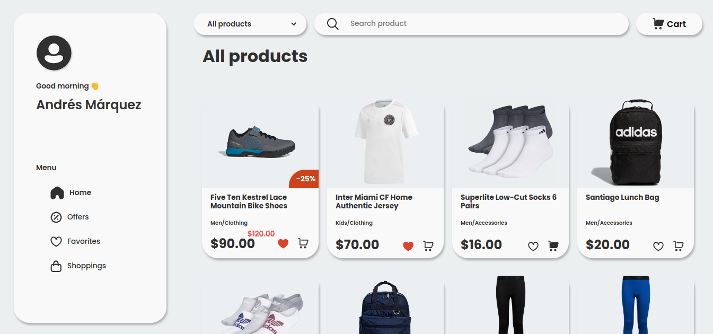
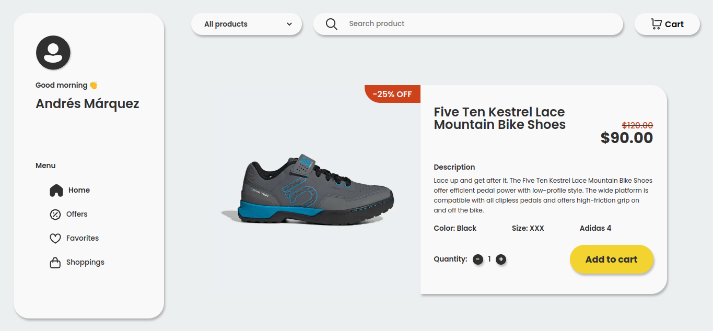
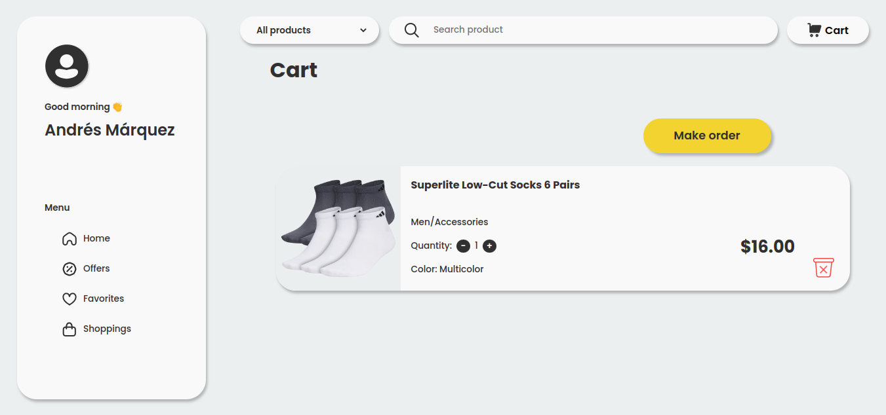
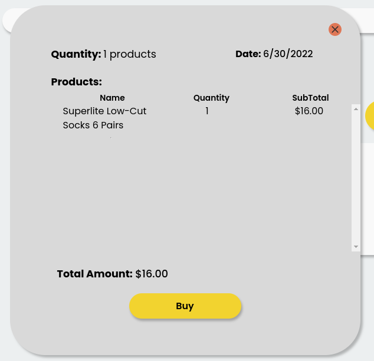
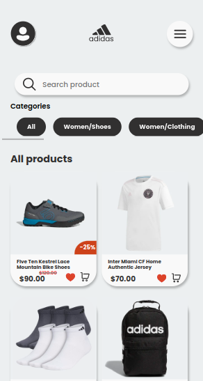
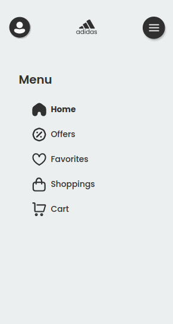
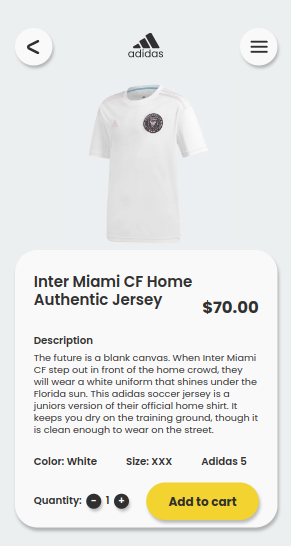
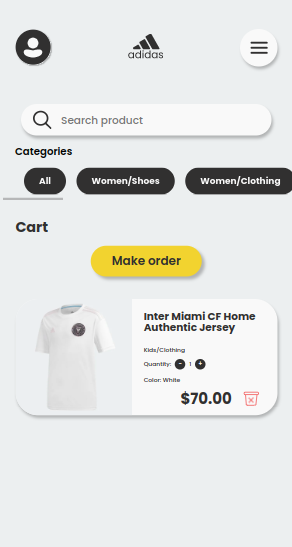

  

# Ecommerce - Adidas Project - React.js

### Resume

This app is a store with adidas products. It shows products, ordered by offers, category and favorites. It has a search bar for searching products. Also, it has a cart and shoppings history sections for doing shops. I used React.js, React Redux for management state, React Router for routing the app and SASS for styling.

### Links

  
  

### Stack used for this project

| Languages  | Libraries |
| ------ | ------ |
|   |   |
|   |   |
|   |   |
|   |   |

### Screenshoots of the app

#### Web

  
  
  
  
  

#### Movil

  
  
  
  
  

